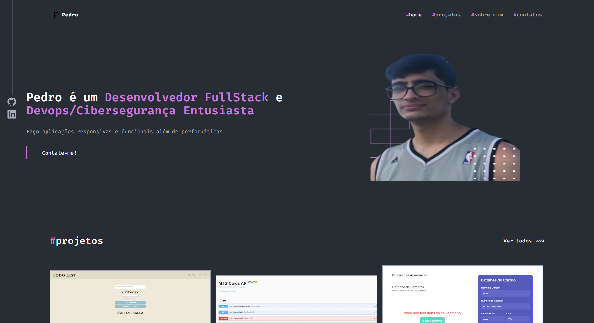
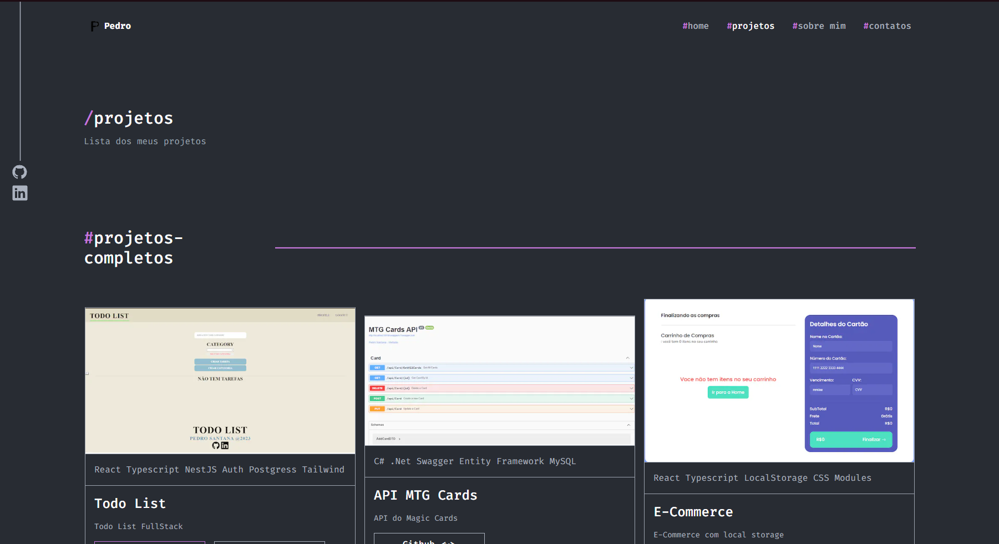
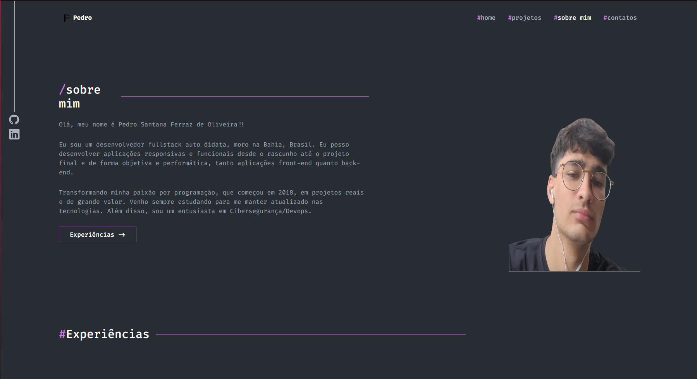
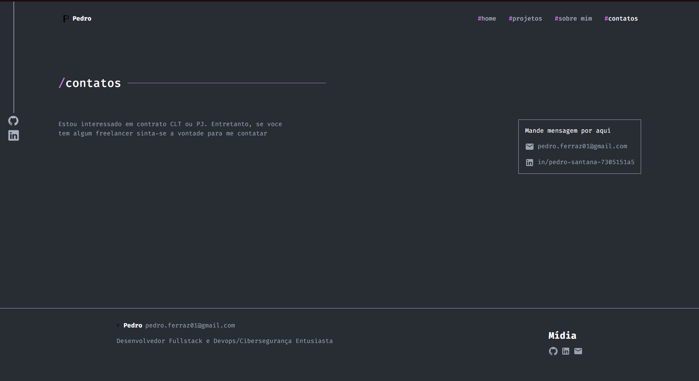

# 💡 Meu Portfolio

Meu portfolio mostrando meus principais trabalhos e como me contatar.

__Você pode ver esse projeto bem  [Aqui](https://meu-portfolio-ten-psi.vercel.app)__


🖥️ Pagina 1 Home                                        | 🖥️ Versão 2 Projetos                                 | 🖥️ Pagina 3 Sobre mim                                      | 🖥️ Pagina 4 Contatos   
:----------:                                            | :--------------:                                      | :--------------:                                           | :--------------: 
            |        |               |  

## ⚙️ Funcionalidades

- ✅ Pagina principal
- ☑️ Acesso aos projetos
- ✅ Skills
- ☑️ Contatos
- ✅ Design Responsivo

## 🧰 Bibliotecas

- ✅ Next JS
- ☑️ TailWindCss
- ✅ Eslint
- ☑️ Mui Material

## ⬇️ Rodando o projeto
```
git clone https://github.com/PedroSantanaa/MyPortfolio.git
```
```
cd MyPortfolio
```
```
cd my-portfolio
```
```
npm i
```
```
npm run dev
```

## 🧩 Tecnologías Utilizadas

<div align="left">
  
  
  
  
  
  
  
  
  
</div>

## ⌛ Status do projeto

- [x] Home Page
- [x] Projetos Page
- [x] Sobre Mim Page 
- [x] Contatos Page
- [ ] Melhorar as imagens 

## 🤯 Aprendizados

Coloquei meus conhecimentos de front end com tailwind nesse projeto, além de me basear em uma Figma que ajudou a por em pratica a parte de Figma to Code.

## 💬 Vamos nos conectar?

<div align="left">
  <a href="https://www.linkedin.com/in/pedro-santana-7305151a5/" target="_blank">
    
  </a>
</div>
